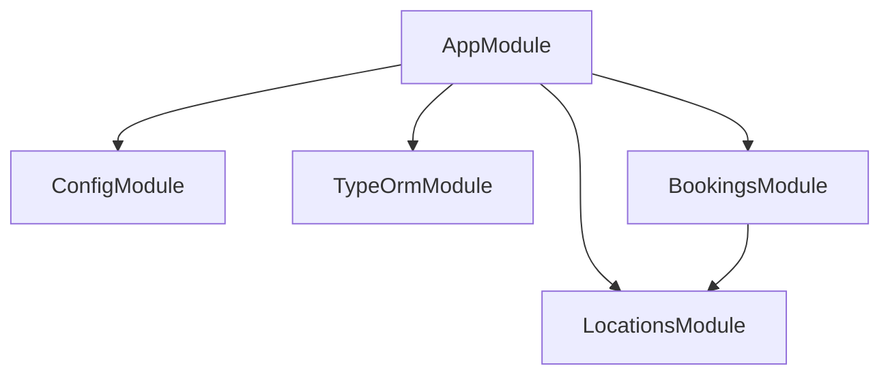
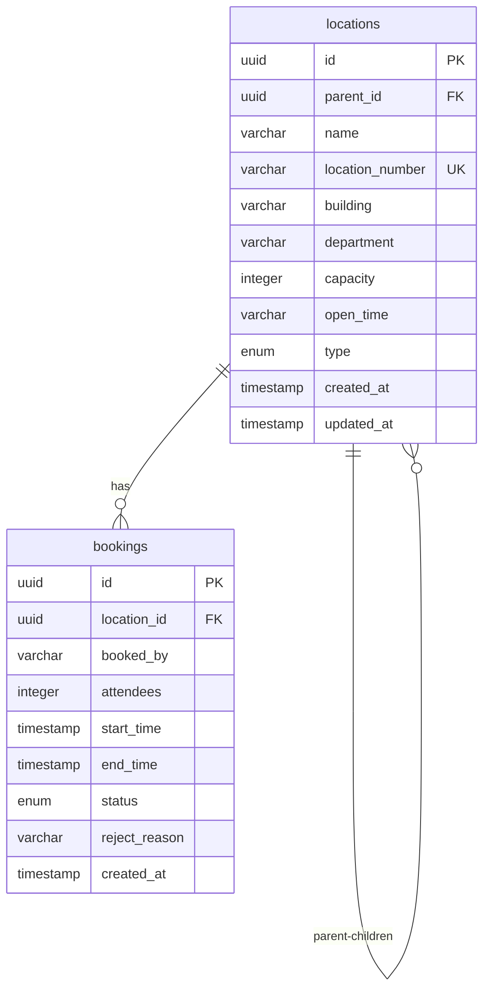
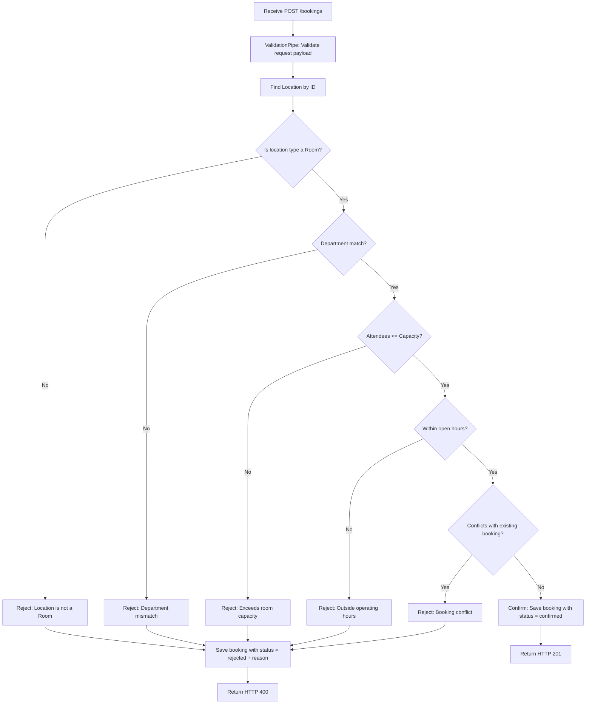

# System Architecture Document

The system follows a **Monolithic** architecture built on the NestJS framework, using TypeORM to communicate with PostgreSQL.

## 1. Module Structure

- **AppModule**: Bootstraps the application and loads all global configuration modules.
- **LocationsModule**: Manages location nodes (Building, Floor, Room, Other) organized as a hierarchical tree.
- **BookingsModule**: Handles room booking requests and enforces all business constraint validations.

## 2. Database Design

## 3. Booking Validation Pipeline

When a new booking request is received (`POST /bookings`), the following validation pipeline is executed:

